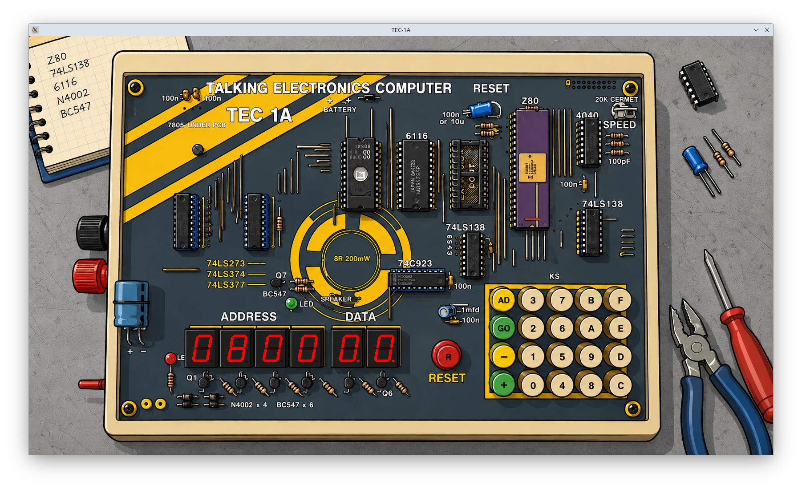
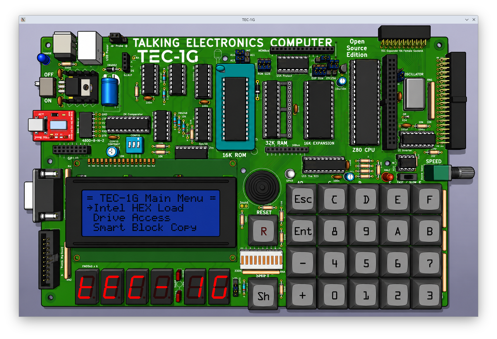
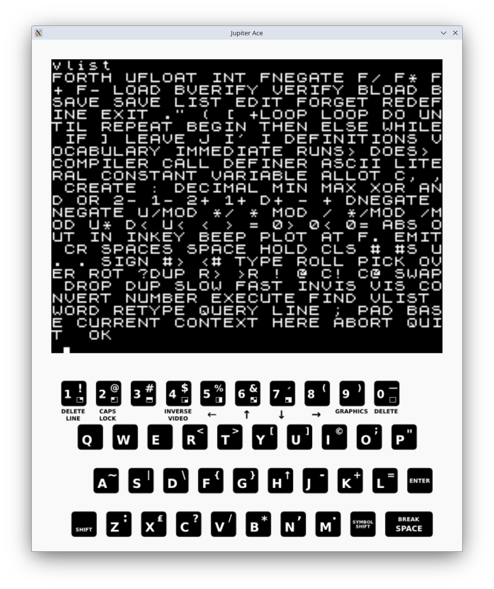

# go_z80
Z80 CPU emulation in Golang.

## What

 * a z80 cpu emulation written in go.
 * Some emulated retro computing platforms that use the z80.

## Emulators

### Talking Electronics Computer TEC-1A

### Talking Electronics Computer TEC-1G

### Jupiter ACE

### Resources
 * Jupiter ACE ROMs, https://jupiter-ace.co.uk/roms.html
 * TEC-1 ROMs, https://github.com/tec1group/Software/tree/master/monitors
 * TEC-1G Details, https://github.com/MarkJelic/TEC-1G
 * HD44780 Emulation, https://github.com/visrealm/vrEmuLcd

### Issues

#### Z80
 * z80 emulation for undocumented flags (XY) is incomplete.
 * zexdoc passes (good), zexall does not pass (undocumented flag support)
   
#### TEC1-A
 * works pretty good...
   
#### TEC1-G
 * Diagnostic ROM passes
 * DS1302 RTC supported
 * Keypad (74c923) supported
 * Matrix keyboard supported
 * Serial port supported (using pseudo-tty)
 * Sound is supported
 * LCD (HD44780) emulation is partial (no display scrolling)
 * Disco RGBs are supported
 * Graphics LCD is not supported

#### Jupiter ACE
 * no tape (*.tap) support
 * it's still a jupiter ace

